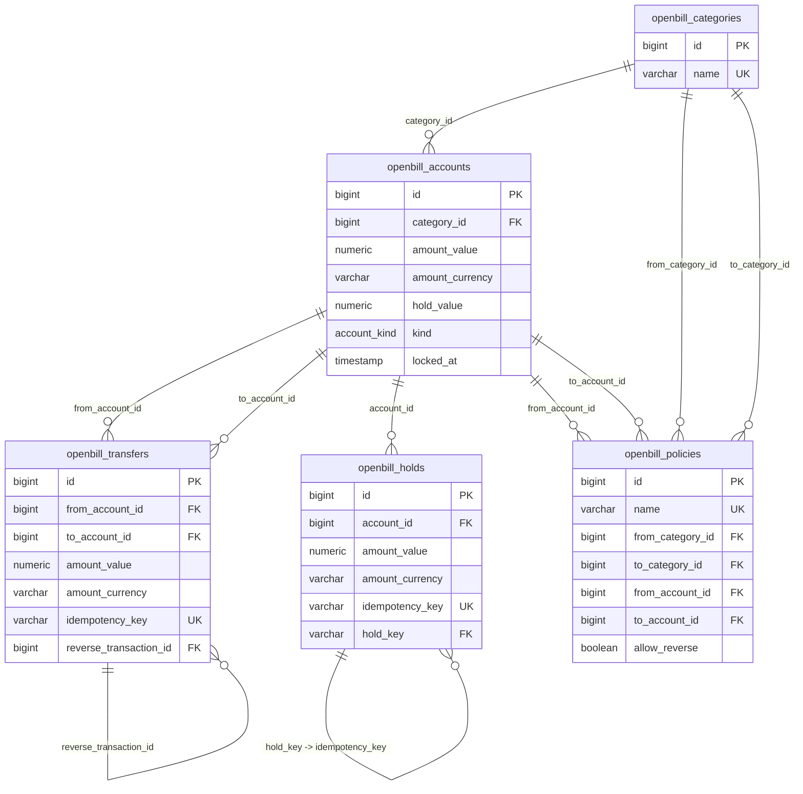

# Сущности Openbill Core

Раздел описывает ключевые сущности ledger-модели Openbill Core и правила работы с ними.

## Карта сущностей

| Сущность | Таблица | За что отвечает |
| --- | --- | --- |
| Счета | `openbill_accounts` | Хранение балансов, валюты, типа счёта и состояния блокировки |
| Трансферы | `openbill_transfers` | Перемещение суммы между двумя счетами с идемпотентностью |
| Категории | `openbill_categories` | Группировка счетов по бизнес-назначению |
| Policy | `openbill_policies` | Разрешённые маршруты переводов между категориями/счетами |
| Удержания | `openbill_holds` | Резервирование (блокировка) средств на счёте без перемещения |

## Как сущности связаны

1. Создаёте категории (`openbill_categories`).
2. Создаёте счета (`openbill_accounts`) и привязываете к категориям.
3. Настраиваете policy (`openbill_policies`) для разрешённых направлений.
4. Выполняете трансферы (`openbill_transfers`) в рамках policy.
5. При необходимости создаёте удержания (`openbill_holds`) для резервирования средств.

## ERD (Mermaid)

## Порядок чтения

1. [Категории](categories.md)
2. [Счета](accounts.md)
3. [Policy](policy.md)
4. [Трансферы](transfers.md)
5. [Удержания](holds.md)

## Связанные разделы

- [Быстрый старт](../getting-started.md)
- [Глоссарий](../glossary.md)
- [Каталог примеров](../examples/README.md)
